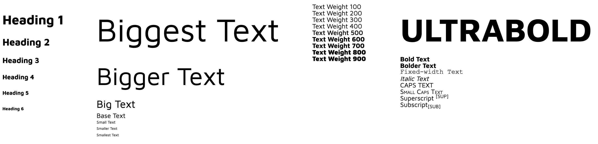

# Scribe
Simply download it and import it from your CSS library.



## Getting started
Download or clone the code.<br /> 
```git clone https://github.com/brandedux/scribe.git```

**Import Scribe:**<br /> 
Import scribe.scss into your app.scss or primary file.<br /> 
```@import './scribe';```

**Example Class:**<br />
Include the scribe class in your markup.<br />
```class="scribe"```

Nest size, weight and alternate classes within the scribe class.<br /> 
```class="txt-base txt-500 txt-italic"```

Nested classes should be used like:<br />
```<div class="scribe">```<br />
```  <p class="txt-bigger txt-900">0 2 8 18 32</p>```<br />
```</div>```<br />

#### 1. Default text size uses Fibonacci scale
* txt-smallest
* txt-smaller
* txt-small
* txt-base
* txt-big
* txt-bigger
* txt-biggest

#### 2. Font-weight array
* txt-100
* txt-200
* txt-300
* txt-400
* txt-500
* txt-600
* txt-700
* txt-800
* txt-900

#### 3. Alternates
* txt-bold
* txt-bolder
* txt-fixed-width
* txt-italic
* txt-caps
* txt-small-caps
* txt-sup
* txt-sub


#### Copyright and License
Copyright (c) 2019, Jeff Davis.

Palette source code is licensed under the [MIT License](LICENSE).
